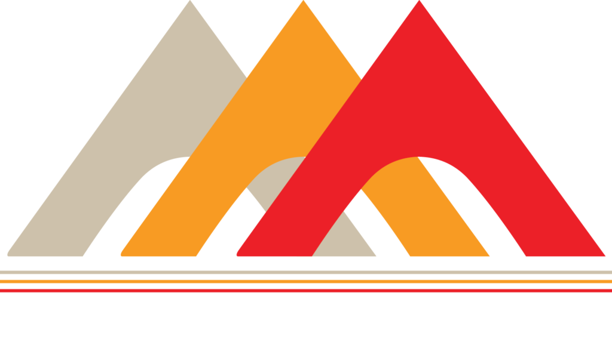

Engineering Design Intern  
Worked on __Solar Resource Assessment__ and __loss analysis__ for Annual Energy Production using PVsyst of grid-connected 100KW Solar PV Project in Noida, Uttar Pradesh; as a contract for engineering procurement at Tech-Vardhan Power Private Limited.
